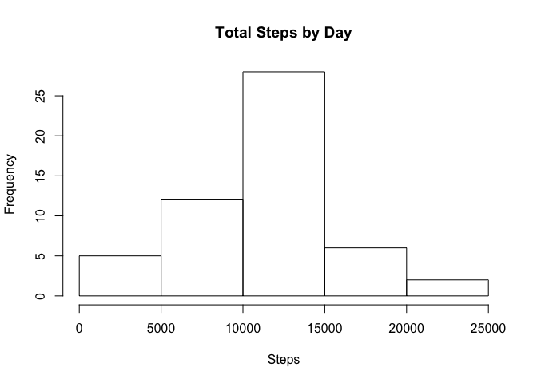
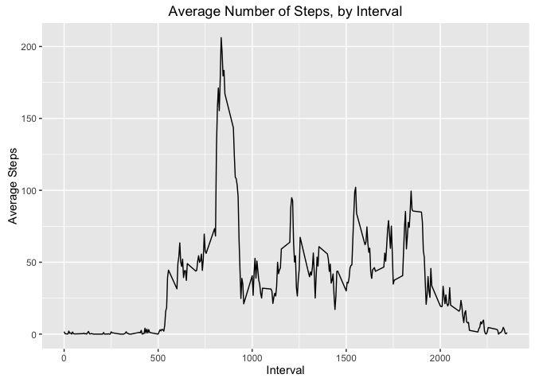
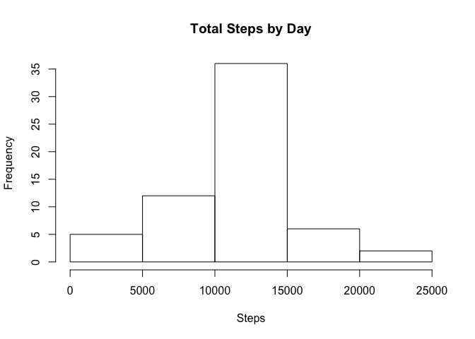
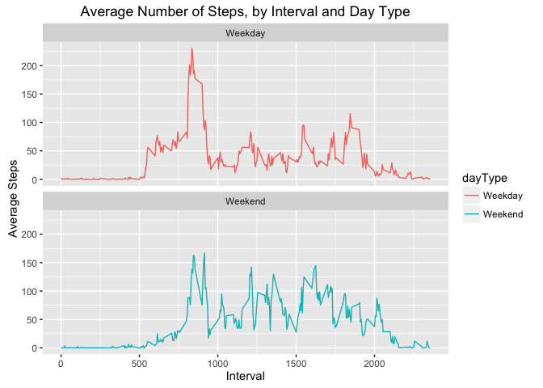

# Reproducible Research: Peer Assessment 1


## Loading and preprocessing the data
Read the csv file and clean up the data by removing NA values and making date values of the date class.


```r
##Load the data
activity <- read.csv("activity.csv")
##Change date variable into date class, remove NAs from data set
activity$date <- as.POSIXct(activity$date, format="%Y-%m-%d")
data <- activity[!is.na(activity$steps),]
```


## What is mean total number of steps taken per day?

```r
##Make a histogram of total number of steps taken each day
stepTotals <- aggregate(list(steps=data$steps),list(date=data$date),sum)
hist(stepTotals$steps,xlab="Steps",main="Total Steps by Day")
```

<!-- -->

```r
##Calculate mean and median total number of steps taken per day
summary(stepTotals)
```

```
##       date                         steps      
##  Min.   :2012-10-02 00:00:00   Min.   :   41  
##  1st Qu.:2012-10-16 00:00:00   1st Qu.: 8841  
##  Median :2012-10-29 00:00:00   Median :10765  
##  Mean   :2012-10-30 17:37:21   Mean   :10766  
##  3rd Qu.:2012-11-16 00:00:00   3rd Qu.:13294  
##  Max.   :2012-11-29 00:00:00   Max.   :21194
```

The mean number of steps per day is 10766; the median number of steps per day is 10765.

## What is the average daily activity pattern?


```r
##Make a time series plot of interval and average number of steps taken
library(ggplot2)
```

```
## Warning: package 'ggplot2' was built under R version 3.2.4
```

```r
byInterval <- aggregate(list(steps=data$steps),list(interval=data$interval),mean)
p <- ggplot(byInterval,aes(x=interval,y=steps))
p+geom_line()+xlab("Interval")+ylab("Average Steps")+ggtitle("Average Number of Steps, by Interval")
```

<!-- -->


```r
##Which interval contains max number of average steps
max <- max(byInterval$steps)
byInterval[byInterval$steps==max,1]
```

```
## [1] 835
```

The 5 minute interval that contains the maximum number of average steps is at interval 835.

## Imputing missing values


```r
##Total number of missing values in the data set
sum(is.na(activity$steps))
```

```
## [1] 2304
```

There are 2304 NA values in the data set.

The following code replaces the NA values with the mean number of steps for the associated interval.  


```r
##Fill in NA values with the associated interval mean
naValues <- activity[is.na(activity$steps), ]
naMerge <- merge(naValues,byInterval,by="interval")
naData <- naMerge[, c(4,3,1)]
colnames(naData) <- c("steps","date","interval")
##Create a new dataset that fills in previously NA values
mergedData <- rbind(data,naData)
##Make a histogram of total number of steps taken each day
stepTotalsNa <- aggregate(list(steps=mergedData$steps),list(date=mergedData$date),sum)
hist(stepTotalsNa$steps,xlab="Steps",main="Total Steps by Day")
```

<!-- -->


```r
##Calculate mean and median total number of steps taken each day
summary(stepTotalsNa)
```

```
##       date                         steps      
##  Min.   :2012-10-01 00:00:00   Min.   :   41  
##  1st Qu.:2012-10-16 00:00:00   1st Qu.: 9819  
##  Median :2012-10-31 00:00:00   Median :10766  
##  Mean   :2012-10-31 00:25:34   Mean   :10766  
##  3rd Qu.:2012-11-15 00:00:00   3rd Qu.:12811  
##  Max.   :2012-11-30 00:00:00   Max.   :21194
```

The mean and median total number of steps taken each day are both 10766.  This is little change to the previously calculated mean and median, likely because we are just applying the mean over the associated interval to each NA value.  

## Are there differences in activity patterns between weekdays and weekends?


```r
##Create a new factor variable with two levels - "Weekday" and "Weekend"
mergedData$day <- weekdays(mergedData$date)
mergedData$daytype <- ifelse(mergedData$day=="Saturday"|mergedData$day=="Sunday","Weekend","Weekday")
##Make panel plot containing time series plot of interval and average number of steps taken, averaged across all weekdays or all weekends
byIntervalDay <- aggregate(list(steps=mergedData$steps),list(interval=mergedData$interval,dayType=mergedData$daytype),mean)
g <- ggplot(byIntervalDay,aes(x=interval,y=steps,color=dayType))+geom_line()+facet_wrap(~dayType,ncol=1,nrow=2)+labs(title="Average Number of Steps, by Interval and Day Type",x="Interval", y="Average Steps")
g
```

<!-- -->

Yes, there are differences in activity patterns between weekdays and weekends, as we see the average number of steps on a weekday peak earlier in the day, while steps remain relatively consistent over the course of a weekend day.  Intuitively, this makes sense since activity levels may be depressed over the course of a work day, peaking only at specific times (going for a run, etc.).  Meanwhile, activity levels may remain consistent over the course of a weekend where work is not an obligation.  
